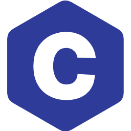

<p align="center">
  
</p>

<h1 align="center">The C documentation</h1>

<p align="center">A documentation with resources for the C language.</p>

### Local development

First step installation dependecies we have [pnpm](https://pnpm.io)

```console
pnpm install --frozen-lockfile
```

You can then start the local development server with:

```console
pnpm run dev
```

This will launch a browser window open to [localhost:3000](http://localhost:300).

You can build the project with:

```console
pnpm run build
```

### Issue Report

[The issues of the CLearn project](https://github.com/openlitedotdev/community/issues?q=is%3Aissue%20state%3Aopen%20label%3ACLearn)

### License

[MIT](./LICENSE)
